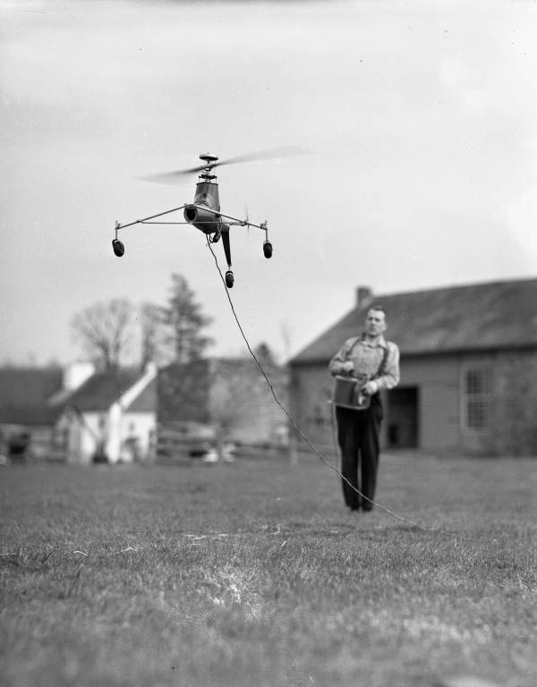

# Hello Metal 6DOF

Basic heli 6DOF movement using the Metal API.

Boilerplate Xcode Metal project showing how to do basic heli [6DOF](https://en.wikipedia.org/wiki/Six_degrees_of_freedom) movement without [gimbal lock](https://en.wikipedia.org/wiki/Gimbal_lock).
Also, the infamous XFile.cpp makes it to the net.
This is not (the begining of) a port of [R/C Sim Sikorsky](https://blacksphere2.github.io/rcsim.html) to Metal.

## Video
Explaining gimbal lock.

## History

*Arthur M. Young, Paoli, Pennsylvania, April 16, 1941*

## Present

*Tareq Alsaadi, Cape Town, South-Africa, June, 2019*

## Project History
The project started as a port of https://github.com/haroldserrano/renderingTextUsingOpenGLiniOS to Metal but turned into something completely different. Only the font atlas remains...

The complete tutorial on how to render Text using OpenGL can be found here:
http://www.haroldserrano.com/blog/rendering-text-using-opengl-es

A more flexible way to do it here: https://en.wikibooks.org/wiki/OpenGL_Programming/Modern_OpenGL_Tutorial_Text_Rendering_01

## See also
* [The Birth of the Bell Helicopter](https://www.youtube.com/watch?v=uir9Engj4v4&list=PL63C95D4821B4CFCE)
* [Philosophy of Physics](https://m.youtube.com/watch?v=DACcyBN5Jng)
* [Quaternions and spatial rotation](https://en.wikipedia.org/wiki/Quaternions_and_spatial_rotation)
