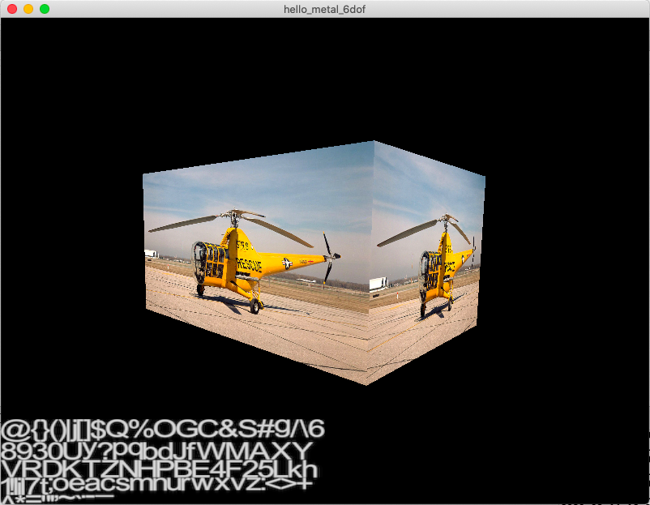

# Hello Metal 6DOF

Basic heli 6DOF movement using the Metal API.

Boilerplate Xcode Metal project showing how to do basic heli [6DOF](https://en.wikipedia.org/wiki/Six_degrees_of_freedom) movement without [gimbal lock](https://en.wikipedia.org/wiki/Gimbal_lock).

Also, he infamous XFile.cpp makes it to the net.

Started as https://github.com/haroldserrano/renderingTextUsingOpenGLiniOS.
But turned into something completely different. Only the font atlas remains...

The complete tutorial on how to render Text using OpenGL can be found here:
http://www.haroldserrano.com/blog/rendering-text-using-opengl-es

A more flexible way to do it here: https://en.wikibooks.org/wiki/OpenGL_Programming/Modern_OpenGL_Tutorial_Text_Rendering_01

